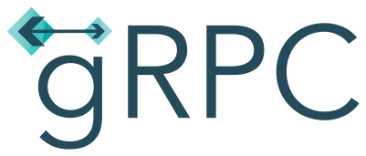

## Hi, I'm Timur
- Student of Applied Mathematics and Computer Science, MAI 
- Looking for an internship as a Go backend developer
## Technologies i use
 

## Contacts
- <a href="https://t.me/megakret">Telegram </a>
